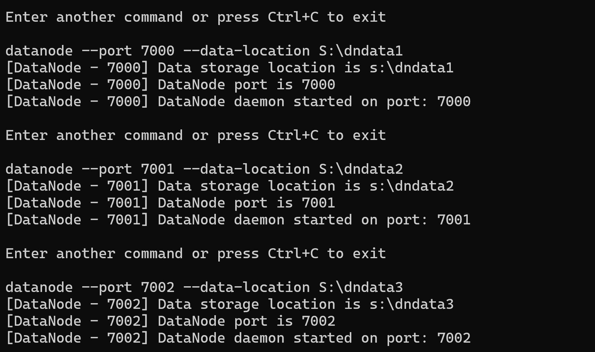
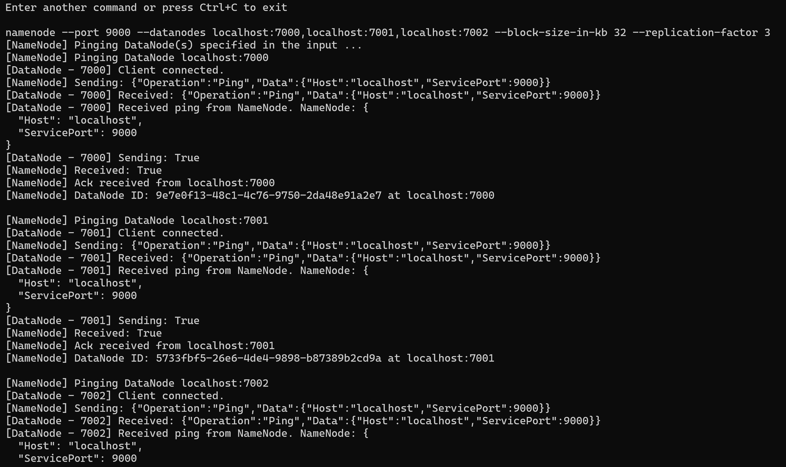
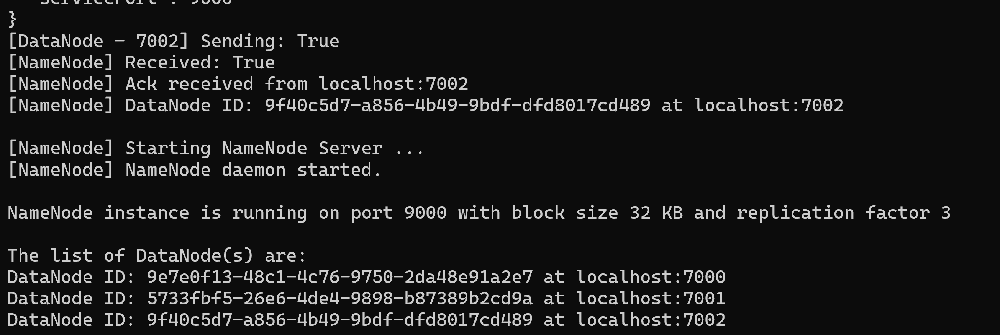
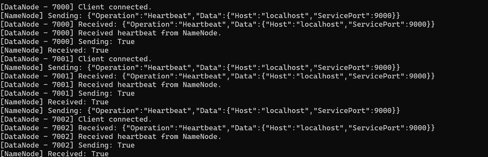

# BareDFS
Very Simple Distributed FileSystem implementation on the lines of [HDFS](https://hadoop.apache.org/docs/r1.2.1/hdfs_design.pdf).

### NameNode
The NameNode is the master and is the single point of contact (and failure!) for coordinating all operations. It provides the clients with all the required metadata for accessing the DataNodes. The NameNode peforms filesystem namespace operation like creation, deleting, renaming & opening/closing files. It also provides the mapping of blocks to DataNodes.

### DataNode
The DataNode is a simple data containing unit and clients talk to them directly to put / get data into / from them. It is the slave in the master-slave architecture.

### Client
The user client sends all the desired requests. A read / write client can be initiated through the command line interface provided.

### Features
- The replication factor for the data blocks can be specified as an input.
- The data block size is also user defined.
- The NameNode tries to check for the heartbeat of the DataNode periodically. It also tries to re-replicate the data blocks in case of failure of a DataNode.
- For `Put` operation, success is returned to the client when the data block is stored in atleast one DataNode. The rest data blocks are replicated asynchronously across the data nodes for the given input replication factor.
- Currently supports only `Put` & `Get` operation, but can be extended for other file system operations as well in future.


## Usage
One NameNode and at least one DataNode(s) must be initiated as daemons process through the command line interface provided.
The entire application and its components can be build and run from the ConsoleApp folder.

The CLI can be compiled to a binary to obtain binaries as:
```batch
cd ConsoleApp
dotnet build
```

To run the DFS, run the below command after the above one:
```batch
dotnet run
```
The datanode should be first setup, then the namenode, and finally the client can do put/get operations.

- **DataNode daemon**
	Syntax:
	```batch
	datanode --port <portNumber> --data-location <dataLocation>
	```
	Sample command:
	```batch
	datanode --port 7002 --data-location .dndata3/
	```

- **NameNode daemon**
	Syntax:
	```batch
	namenode --port <portNumber> --datanodes <dnEndpoints> --block-size <blockSize> --replication-factor <replicationFactor>
	```
	Sample command:
	```batch
	namenode --port 9000 --datanodes localhost:7000,localhost:7001,localhost:7002 --block-size 10 --replication-factor 2
	```

- **Client**
Currently Put and Get operations are supported
	- **Put** operation
	Syntax:
		```batch
		client --namenode <nnEndpoint> --operation put --source-path <locationToFile> --filename <fileName>
		```
		Sample command:
		```batch
		client --namenode localhost:9000 --operation put --source-path S:\ --filename foo.bar
		```
	- **Get** operation
	Syntax:
		```batch
		client --namenode <nnEndpoint> --operation get --filename <fileName>
		```
		Sample command:
		```batch
		client --namenode localhost:9000 --operation get --filename foo.bar
		```

### Example Demo:





Background Heartbeat Job:




### Running Individual Services
Each service can be run individually as well for the purpose of testing.

- **DataNode**
  ```batch
  cd DFS\DataNode\ConsoleApp
  dotnet run
  ```
  Then use the command similar to the above for DataNode.

- **NameNode**
  ```batch
  cd DFS\NameNode\ConsoleApp
  dotnet run
  ```
  Then use the command similar to the above for NameNode.

- **Client**
  ```batch
  cd Client\ConsoleApp
  dotnet run
  ```
  Then use the command similar to the above for Client.


### Containerized through Docker Compose
- Build the images for the components:
    ```batch
     docker build -t datanode -f deployment/DataNode/Dockerfile .
     docker build -t namenode -f deployment/NameNode/Dockerfile .
     docker build -t client -f deployment/Client/Dockerfile .
    ```
- Initiate the DataNode and the NameNode services (scale up accordingly):
    ```batch
    docker-compose up --scale datanode=6 --remove-orphans --force-recreate
    ```
- Start the client in a new container under the base host:
    ```batch
    docker run -it --network host client
    ```
 - Make file `put` and `get` requests using similar commands as above
